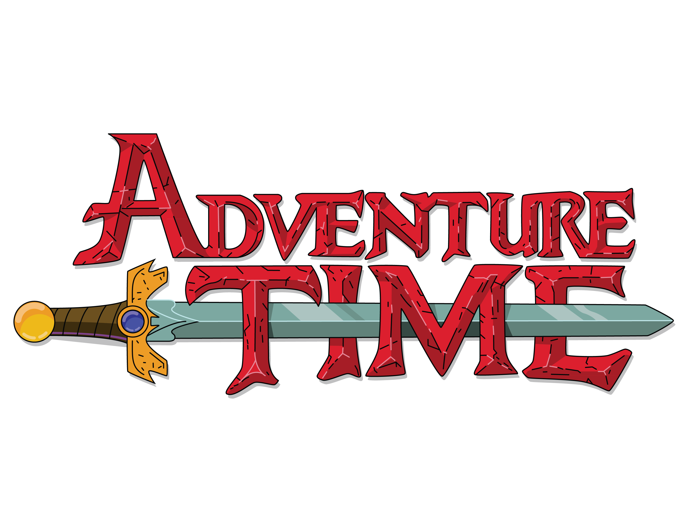

# Adventure Time : The Rescue

## Introduction

### About me:

Hello!
Welcome to my **first** Project!

My name is Alan Sanchez, from Argentina. I have no previous experience with programming, but I am putting all my time and effort to learn everything I can.
I am so excited to finally show that I learned in this first three weeks of the **IronHack Bootcamp** of Web Development.

### About the Project

The idea of the project was to create a Game with p5 or DOM manipulation. 
I chose to do it with p5.

## Story of the Game:

The Ice King took the Enchiridion and kidnapped Jake!. Finn is the only one who can save him!. Help him cross the Forest and find Jake.

## Instructions for playing:

* Press 'SPACE' to JUMP and avoid Ice King's attacks.
* If you are hit by an attack, you will lose one HEART.
* Collect all the PAGES from the Enchiridion, the book of Heroes, as you go through the Forest.
* If you lose all the HEARTS, Ice King will win, and its GAME OVER.

## Disclaimer:

**I do NOT own any of the pictures and music from this game or Adventure Time. This is a project made only for learning purposes. All the copyrights correspond to Cartoon Network (TM)**
